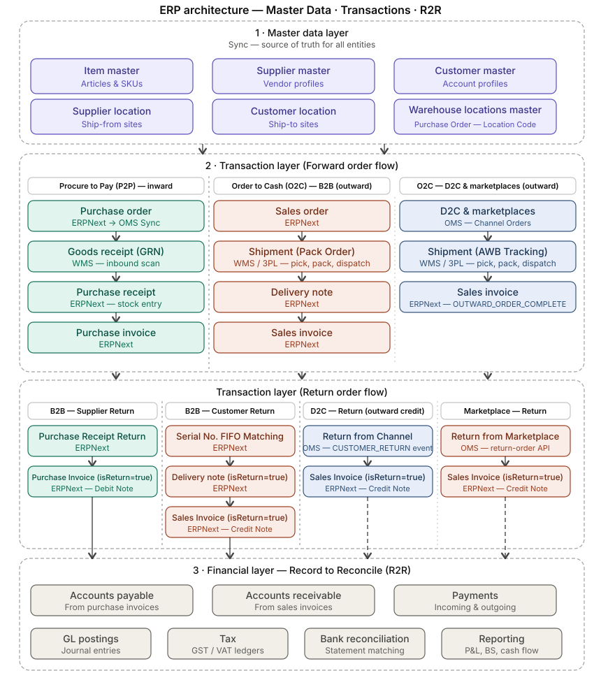

<!-- ┌─────────────────────────────────────────────────────────────────────┐
     │  Profile README for soumyasethy/soumyasethy                          │
     │  Theme: terminal · matrix · hacker · tokyonight                       │
     └─────────────────────────────────────────────────────────────────────┘ -->

<p align="center">
  
</p>

<p align="center">
  
</p>

<p align="center">
  <a href="https://x.com/soumyarsethy"></a>
  <a href="https://linkedin.com/in/soumyasethy"></a>
  <a href="https://medium.com/@soumyasethy"></a>
  
  
</p>

---

### `$ ./now.sh`

**[lazychat-erpnext](https://github.com/soumyasethy/lazychat-erpnext)** —
open-source AI assistant docked into the ERPNext desk.
**101-tool MCP server**, BYO LLM (any OpenAI-compatible or Anthropic key,
stays in your browser), Apply-gated mutations, vision-judge self-iteration.
The Frappe community's first AI-native sidekick.

**LazyCode.in** *(soon — private beta)* —
AI coding agent for Frappe / ERPNext apps. The dev-side counterpart to LazyChat:
LazyChat helps users *work* in ERPNext, LazyCode helps developers *build* on it.

---

### `$ ./shipped.sh` — Shopify-class e-commerce, end-to-end on ERPNext

Architected and built a production omnichannel e-commerce stack from zero
for a fashion / D2C brand — **manufacturing to last-mile delivery, on one ledger**.
Today **running multiple ERPNext companies in production** on the same Frappe backbone.

**Business processes I own end-to-end**
**P2P** (Procure-to-Pay) · **O2C** (Order-to-Cash) · **R2R** (Record-to-Report) — all wired into one source of truth on ERPNext.

**Functional systems I designed and shipped**
**OMS** · **WMS** · **PIM** · **PLM** · **MES** (manufacturing planning) · **Marketplace Listing & inventory sync** · **Product Traceability** with EAN / serialization

**Architecture depth** — three-layer separation: **Master Data · Transactions · Financial R2R**. **B2B + D2C + Marketplace** channels reconciled to one ledger. Full forward *and* return flow with **Serial-No FIFO matching**, `isReturn=true` invoice flagging, automatic Credit / Debit Notes. Production webhook surface across GRN inbound, outward order lifecycle (CREATE · COMPLETE · SHIPMENT_DISPATCH · DELIVER · CANCEL / PARTIAL_CANCEL) and channel returns. Shopify D2C webhook stream for order + customer events.

<p align="center">
  
</p>

<details>
<summary><b>Production webhook surface</b> (click to expand)</summary>

| Event | Purpose |
|---|---|
| `POST_GRN_GATE_ENTRY_WISE_URL` | Goods receipt — inbound scan |
| `POST_ORDER_URL` | Outward order lifecycle — CREATE · COMPLETE · SHIPMENT_DISPATCH · DELIVER · CANCEL · PARTIAL_CANCEL |
| `RETURN_ORDER_POSTING_URL` | D2C + marketplace returns |
| `CREATE_SHIPMENT_URL` | B2B shipment (pack order) |
| `GET_INVOICE_URL` | ERPNext sales invoice fetch |
| Shopify D2C inbound | Order create · cancel · update; customer create |

</details>

**Live integrations** — wired through a Java-based integration platform I architected (in-house middleware that sits between ERPNext and the rest of the operating world):

- **ERPNext ↔ e-Waybill** (Indian goods-movement compliance)
- **ERPNext ↔ Shiprocket + Cargofl** (last-mile delivery aggregators across the D2C courier mesh)
- **ERPNext ↔ GSTR-1** (statutory returns automation)
- **EAN / barcode** generation for traceability and serialization across the warehouse
- **5-bank H2H banking** (ICICI · HDFC · AXIS · YES · Kotak Mahindra) via [india-banking](https://github.com/agi-engg/india-banking) on Frappe
- **D2C ecosystem** — **Shopify Plus**, **Gokwik** (1-click checkout), **Return Prime** (returns management)
- **Increff** — full-ecosystem fluency (WMS · OMS · CIMS · ICC · reports · tech operations)
- Marketplace catalogue + inventory sync to external storefronts

| Layer | Built with |
|---|---|
| Storefront | React + TypeScript + Tailwind + Vite + Storybook |
| Mobile | React Native + Flutter companion apps |
| Backend | Frappe / ERPNext (Python) · Java microservices · Node BFFs · Kafka |
| Integration middleware | Java platform — connectors, retry, idempotency, audit trail |
| Data | PostgreSQL · MariaDB · Redis · BigQuery |
| Infra | GCP · Docker · GitHub Actions · Cloudflare |

Open-source pieces from this stack live at **[@agi-engg](https://github.com/agi-engg)**.

---

### `$ ./behind-the-wall.sh`

The open-source pieces above are a slice. Behind the `@agi-engg` wall sit ~50 private services and apps I've architected and led: **AI pricing-intelligence** (ML-driven SKU pricing), **AI customer chatbots**, **a Customer Data Platform** (Java + Kafka + BigQuery — 360° across web · app · marketplace · OMS), **WMS extensions on top of Increff** (bulk-picking, put-away), **a 3D tech-pack tool** (fashion design-to-BOM), **warranty + return workflow apps** on ERPNext, **API gateways** with unified auth · rate-limit · observability, **shop-floor mobile apps** for MES, **an internal control-center dashboard** that's the team's single pane of glass, and **corporate web properties** (careers · policy portal · brand sites).

---

### `$ ./range.sh` — full-stack across the journey

<p>
  
  
  
  
  
  
  
</p>
<p>
  
  
  
  
  
</p>
<p>
  
  
  
  
  
  
</p>
<p>
  
  
  
  
  
</p>
<p>
  
  
  
  
  
</p>
<p>
  
  
  
  
  
</p>

<table>
<tr><td><b>Business</b></td><td>P2P · O2C · R2R · OMS · WMS · PIM · PLM · MES · Marketplace listings · Traceability & serialization · GST / e-Waybill compliance · D2C platforms (Shopify Plus · Gokwik · Return Prime · Increff WMS/OMS/CIMS/ICC)</td></tr>
<tr><td><b>Frontend</b></td><td>React · Next.js · Vite · TypeScript · Tailwind · Storybook · React Native Web · micro-frontends · widgetized JSON UIs (Figma-class design platforms) · Figma</td></tr>
<tr><td><b>Mobile</b></td><td>React Native · Flutter · Native Android (Java / Kotlin / Android Studio) · iOS (Swift / Xcode) · Google Play & App Store releases</td></tr>
<tr><td><b>Backend</b></td><td>Python · Java · Node.js · Frappe · Kafka · gRPC · REST · sh scripts</td></tr>
<tr><td><b>Data</b></td><td>PostgreSQL · MariaDB · MySQL · Redis · BigQuery · Google Cloud Storage</td></tr>
<tr><td><b>Infra & DevOps</b></td><td>GCP (Compute · VPC · Load Balancers · Cloud DNS · GCS · AI Studio) · Docker · Nginx · GitHub Actions CI/CD · Cloudflare · GoDaddy DNS · Supervisor / systemd</td></tr>
<tr><td><b>Growth & analytics</b></td><td>Google Analytics · Google Ads · MoEngage · NPM publishing</td></tr>
<tr><td><b>AI & Automation</b></td><td>MCP servers · Anthropic · OpenAI-compatible · BYO-LLM patterns · vision-judge loops · workflow automation · AI chatbot product (LazyChat) · AI coding agent (LazyCode)</td></tr>
</table>

---

### `$ ./journey.log`

```
2013     Started on Android. CS algorithms — Splitwise CashFlow (15★).
2017–20  Mobile era. RN-from-scratch, Flutter clones (Inshorts 8★).
2020–23  Frontend platforms. Widgetized JSON UIs. Micro-frontends.
              Design systems at Figma-class scope.
2023–25  Built a Shopify-class e-commerce end-to-end on ERPNext —
              manufacturing to last-mile. P2P · O2C · R2R on one ledger.
              Java middleware wired e-Waybill, Shiprocket + Cargofl,
              GSTR-1, Increff, 5 banks live. Multi-company in production.
2025–26  AI-on-ERPNext. LazyChat (101-tool MCP, BYO LLM).
              LazyCode (AI coding agent for Frappe).
```

---

### `$ ./stats.sh`

<p align="center">
  
  
</p>

<p align="center">
  
</p>

<p align="center">
  
</p>

<p align="center">
  
</p>

---

### `$ ./contact.sh`

If you run an **ERPNext shop** and want AI on top — start with [lazychat-erpnext](https://github.com/soumyasethy/lazychat-erpnext).
If you're building a **0→1 product** and need a software architect or technical co-founder —
[DMs open on X](https://x.com/soumyarsethy) · [LinkedIn](https://linkedin.com/in/soumyasethy).

<p align="center">
  
</p>
